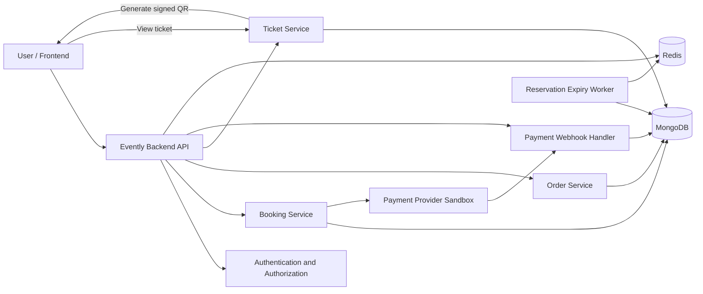
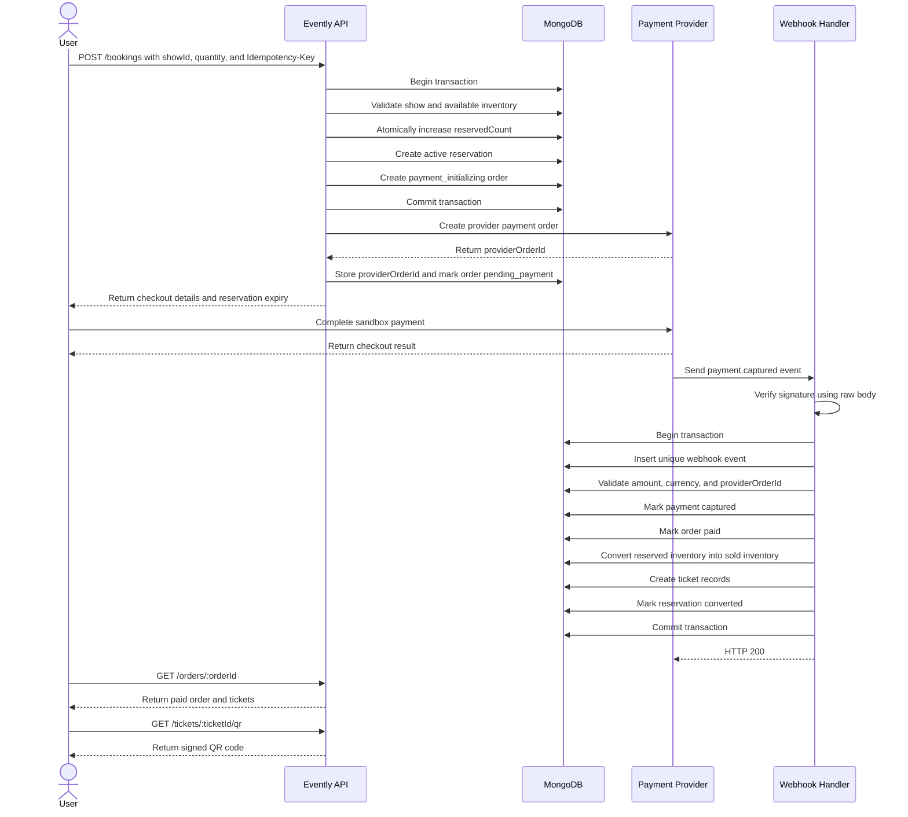
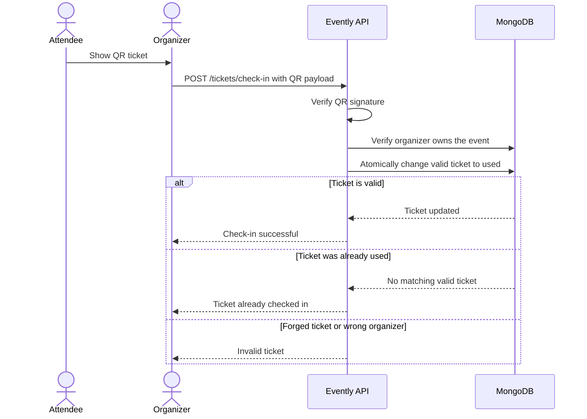
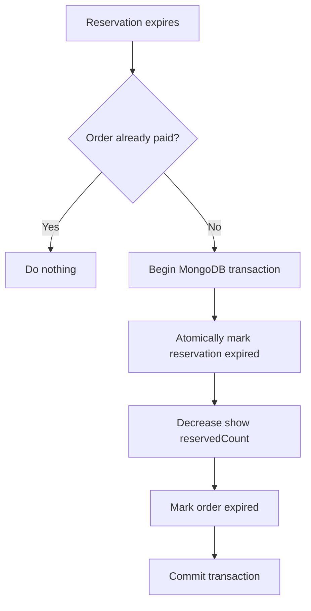
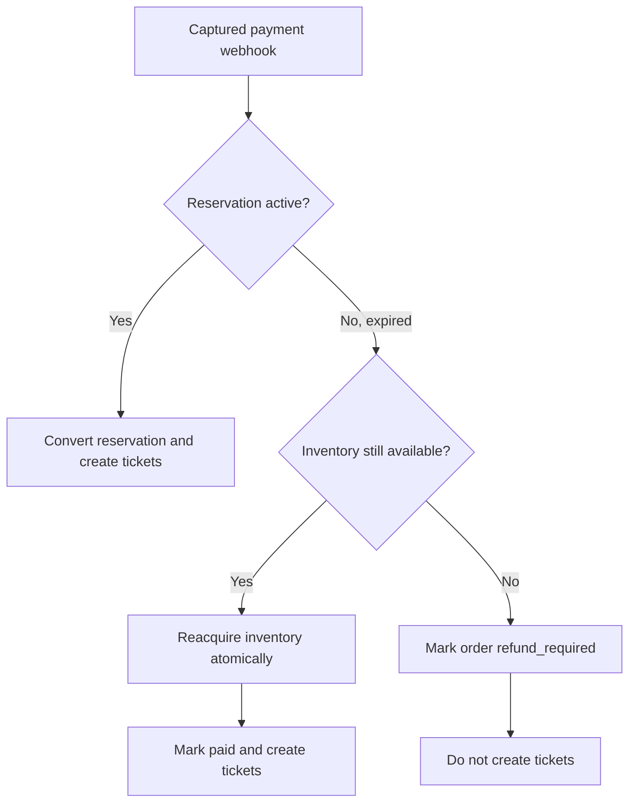

# Evently Phase 2: Payment and Ticket Architecture

## Scope

Phase 2 covers the backend booking, inventory, payment, order, and QR-ticket workflow.

- No account email verification.
- No email dependency for delivering tickets.
- Users view purchased QR tickets inside **My Orders / My Tickets**.
- MongoDB is the source of truth for inventory and payment state.
- Redis may assist with scheduling, caching, and rate limiting, but it must not be the only protection against overselling.

## System architecture



MongoDB stores:

- Available inventory
- Reservations
- Orders
- Payment status
- Tickets
- Ticket check-in status

## Database models

### EventShow

One event can contain multiple scheduled shows.

```text
EventShow
├── eventId
├── startsAt
├── pricePaise
├── capacity
├── reservedCount
├── soldCount
├── salesOpenAt
├── salesCloseAt
└── status
```

Available inventory is calculated as:

```text
available = capacity - reservedCount - soldCount
```

### Reservation

A reservation temporarily holds inventory while the user completes payment.

```text
Reservation
├── showId
├── orderId
├── quantity
├── status
│   ├── active
│   ├── converted
│   ├── expired
│   └── released
├── expiresAt
└── timestamps
```

A reservation will normally remain active for approximately 10 minutes.

### Order

An order represents a user's purchase attempt.

```text
Order
├── userId
├── showId
├── eventId
├── quantity
├── unitPricePaise
├── totalAmountPaise
├── currency
├── idempotencyKey
├── status
│   ├── payment_initializing
│   ├── pending_payment
│   ├── paid
│   ├── payment_failed
│   ├── expired
│   ├── cancelled
│   └── refund_required
└── timestamps
```

The order stores a price snapshot. Changing the show price later must not change existing orders.

### Payment

The payment record stores identifiers and status reported by the payment provider.

```text
Payment
├── orderId
├── provider
├── providerOrderId
├── providerPaymentId
├── amountPaise
├── currency
├── status
│   ├── created
│   ├── authorized
│   ├── captured
│   ├── failed
│   └── refunded
├── verifiedAt
└── timestamps
```

Provider order and payment IDs require unique indexes to prevent duplicate payment records.

### WebhookEvent

This collection records provider webhook events that Evently has received.

```text
WebhookEvent
├── provider
├── providerEventId
├── eventType
├── payloadHash
├── status
├── processedAt
└── error
```

`provider + providerEventId` requires a unique compound index. Receiving the same webhook more than once must not repeat inventory updates or ticket creation.

### Ticket

Tickets are created only after payment has been verified.

```text
Ticket
├── orderId
├── userId
├── eventId
├── showId
├── ticketNumber
├── publicCode
├── status
│   ├── valid
│   ├── used
│   ├── cancelled
│   └── refunded
├── checkedInAt
├── checkedInBy
└── timestamps
```

If a user buys three tickets, Evently creates three ticket records and three QR codes.

`Reservation.orderId` is the single relationship between a reservation and its order. `Order` does not store `reservationId`, avoiding a redundant circular reference. A unique index on `Reservation.orderId` enforces one reservation per order.

## Successful payment flow



## Step 1: Initiate a booking

```http
POST /api/v1/bookings
Authorization: Bearer <access-token>
Idempotency-Key: <unique-client-generated-key>
Content-Type: application/json
```

```json
{
  "showId": "show-object-id",
  "quantity": 2
}
```

The backend must:

- Verify that the logged-in account has the `user` role.
- Validate the quantity against configured limits.
- Confirm that the event is published.
- Confirm that the show is scheduled.
- Confirm that ticket sales are open.
- Read the price from the database, never from the frontend.
- Calculate the amount using integer paise.

The frontend must never be trusted to provide the final payable amount.

## Step 2: Atomically reserve inventory

Inside a MongoDB transaction, the backend performs a conditional update equivalent to:

```javascript
{
  _id: showId,
  status: 'scheduled',
  $expr: {
    $gte: [
      {
        $subtract: [
          '$capacity',
          { $add: ['$reservedCount', '$soldCount'] }
        ]
      },
      quantity
    ]
  }
}
```

The inventory update is:

```javascript
{
  $inc: {
    reservedCount: quantity
  }
}
```

If another request reserves the remaining tickets first, the conditional update matches no show. Evently responds with:

```json
{
  "code": "INSUFFICIENT_INVENTORY",
  "message": "Not enough tickets are available."
}
```

This conditional database update prevents overselling. Redis locks alone will not be trusted for inventory correctness.

## Step 3: Create the reservation and local order

Within the same MongoDB transaction, Evently must:

- Increase `reservedCount`.
- Create an active reservation.
- Set the reservation expiry time.
- Create the local order.
- Store the unit price, quantity, currency, and total.
- Store the idempotency key.

The order should have a unique compound index on:

```text
userId + idempotencyKey
```

If the frontend repeats a request because of a network problem, Evently returns the existing order instead of reserving inventory twice.

## Step 4: Create the provider payment order

After committing the reservation, Evently creates an order with the payment provider.

The provider receives:

- Amount in paise
- Currency
- Local Evently order ID as its receipt/reference
- Relevant non-sensitive metadata

When provider-order creation succeeds, Evently stores `providerOrderId` and changes the order to `pending_payment`.

If provider-order creation fails:

- Mark the Evently order as `payment_failed`.
- Release the reservation.
- Decrease `reservedCount` in a MongoDB transaction.
- Allow the user to start a new booking.

## Step 5: Complete provider checkout

The backend returns the provider checkout details to the frontend. The frontend then opens the provider's checkout interface.

The checkout result shown in the browser must not directly mark the Evently order as paid.

```text
Frontend reports payment success
               ↓
       Order remains pending
               ↓
   Verified webhook is received
               ↓
        Order becomes paid
```

## Step 6: Receive and verify the webhook

The provider calls a route such as:

```http
POST /api/v1/webhooks/razorpay
```

This route must receive the raw request body. Signature verification must use the original request bytes, not re-serialized JSON.

The webhook handler must:

1. Read the raw request body.
2. Verify the provider signature.
3. Reject invalid signatures.
4. Extract the provider event ID.
5. Check whether the event was already processed.
6. Validate the provider order ID, amount, and currency.
7. Finalize the order inside a MongoDB transaction.

The verified webhook—not a frontend callback—is the source of truth for successful payment.

## Step 7: Convert reserved inventory into sold inventory

Inside the webhook MongoDB transaction:

```text
EventShow.reservedCount -= quantity
EventShow.soldCount     += quantity

Reservation.status = converted
Payment.status     = captured
Order.status       = paid
Tickets            = created
```

All updates must either succeed together or fail together.

If the provider delivers the same webhook twice, the unique webhook-event index and existing paid-order check prevent duplicate inventory changes and duplicate tickets.

## Step 8: Generate QR tickets

Evently creates tickets only after verified payment.

The recommended QR payload is:

```text
ticketId.publicCode.signature
```

The signature is produced using a server-side secret:

```text
signature = HMAC(ticketId + publicCode, QR_SIGNING_SECRET)
```

The app requests a QR code through:

```http
GET /api/v1/tickets/:ticketId/qr
```

The backend verifies that the ticket belongs to the logged-in user and returns a generated QR image. The user can reopen the app and generate the same valid ticket QR when needed.

## Ticket check-in flow



The check-in update is conceptually:

```javascript
Ticket.findOneAndUpdate(
  {
    _id: ticketId,
    status: 'valid'
  },
  {
    $set: {
      status: 'used',
      checkedInAt: new Date(),
      checkedInBy: organizerId
    }
  },
  {
    returnDocument: 'after'
  }
)
```

Only one scanner can change a ticket from `valid` to `used`. A second scan receives an already-used response.

## Reservation-expiration flow



A worker periodically searches for:

```javascript
{
  status: 'active',
  expiresAt: { $lte: new Date() }
}
```

The worker conditionally changes the reservation from `active` to `expired`. Only the worker that successfully changes its state may release the inventory.

A MongoDB TTL index alone is insufficient. Deleting an expired reservation does not automatically decrease `EventShow.reservedCount`; the worker must release inventory transactionally.

## Delayed-payment edge case

A captured-payment webhook might arrive after the reservation has expired.



For the resume prototype, Evently can record `refund_required` as an operational exception. Fully automated refunds may be documented as a future improvement.

## Phase 2 API endpoints

### User bookings and orders

```text
POST   /api/v1/bookings
POST   /api/v1/payments/verify
GET    /api/v1/orders
GET    /api/v1/orders/:orderId
GET    /api/v1/orders/:orderId/tickets
GET    /api/v1/orders/:orderId/payment-status
```

### Tickets

```text
GET    /api/v1/tickets/:ticketId
GET    /api/v1/tickets/:ticketId/qr
```

### Organizer operations

```text
GET    /api/v1/organizer/events/:eventId/orders
POST   /api/v1/tickets/check-in
```

### Payment provider

```text
POST   /api/v1/webhooks/razorpay
```

### Internal worker/testing operation

```text
POST   /api/v1/internal/reservations/release-expired
```

The internal cleanup route must not be publicly accessible. In deployment, a protected worker or scheduled job should invoke the cleanup service directly.

## Core correctness rule

```text
Temporary reservation protects inventory
                    +
Verified payment webhook confirms money
                    +
MongoDB transaction creates the paid order and tickets
```

MongoDB and the external payment provider cannot participate in one shared ACID transaction. Evently handles that boundary using state transitions, idempotency, verified webhooks, conditional inventory updates, retries, and explicit failure states.

## Required Phase 2 tests

- Successful reservation and payment
- Insufficient inventory
- Multiple users racing for the final tickets
- Repeated booking request with the same idempotency key
- Payment-provider order creation failure
- Invalid webhook signature
- Duplicate webhook delivery
- Incorrect payment amount or currency
- Reservation expiration and inventory release
- Payment webhook arriving after reservation expiry
- User accessing another user's order or ticket
- Organizer accessing an event they do not own
- Duplicate ticket scan
- QR signature tampering
- Transaction rollback after an injected failure
